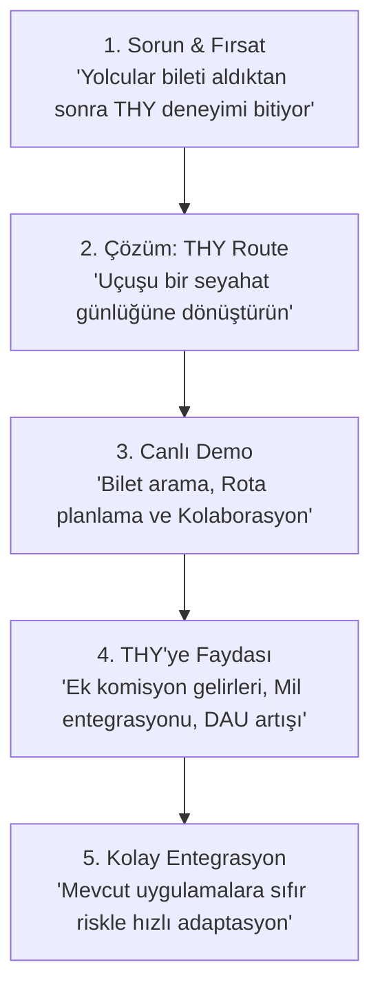

# 🛫 THY Route — Türk Hava Yolları B2B Entegrasyon & Satış Stratejisi

Bu doküman, **THY Route** uygulamasının Türk Hava Yolları (THY) yönetim kadrosuna, dijital inovasyon ekiplerine ve iş geliştirme departmanına sunulurken kullanılacak **değer önerisini (Value Proposition)**, **bütünleşik seyahat deneyimi** vizyonunu ve teknik entegrasyon avantajlarını özetlemektedir.

---

## 🎯 Temel Felsefe: "Bilet Değil, Deneyim Satmak"
Havayolu sektöründe sadece A noktasından B noktasına taşıma hizmeti sunmak artık bir emtia (commodity) haline gelmiştir. Sektördeki küresel liderler, kullanıcı sadakatini artırmak ve ek gelir (ancillary revenue) elde etmek için **Uçtan Uca Seyahat Küratörlüğü** (End-to-End Travel Curation) modeline geçmektedir.

**THY Route**, THY yolcularına sadece bilet satmakla kalmaz, uçuştan seyahat sonuna kadar sürecek interaktif bir günlük ve planlama ekosistemi sunar.

---

## 💎 THY İçin Temel Değer Önerileri (Business Value)

### 1. Ek Gelir Fırsatları (Ancillary Revenue & Affiliate Integration)
* **İş Ortaklığı Pinleri (Hilton, Avis vb.):** Yolcular rota oluştururken THY'nin anlaşmalı olduğu otelleri, araç kiralama şirketlerini (Hilton, Avis vb.) sponsorlu pinler olarak haritada görür ve tek tıkla rotasına ekler. Bu entegrasyon, THY'nin komisyon gelirlerini doğrudan artırır.
* **Miles&Smiles Teşvikleri:** Rota üzerindeki yerel işletmelerden (restoran, müze) yapılacak harcamalara veya otel/araç kiralama işlemlerine Miles&Smiles milleri kazandırılması/harcanması entegre edilerek sadakat programı güçlendirilir.

### 2. Organik Kullanıcı Kazanımı ve Viral Büyüme (Network Effect)
* **Yardımcı Pilot (Co-pilot) Modu:** Seyahat sahibi rota linkini arkadaşlarıyla paylaştığında, arkadaşları sisteme dahil olup rotayı birlikte düzenleyebilir. Bu süreç, THY markasının seyahat grupları arasında organik ve viral olarak yayılmasını sağlar. Rota linkini açan her kullanıcı potansiyel yeni bir THY müşterisidir.

### 3. Kullanıcı Etkileşimi (Customer Engagement) ve Uygulamada Kalma Süresi
* Yolcular seyahat öncesinde ve seyahat sırasında uygulamayı sürekli açık tutarak gün bazlı rotalarını takip eder, not ekler ve yer keşfederler. Bu durum THY Mobil uygulamasının **günlük aktif kullanıcı (DAU)** ve **uygulamada kalma süresi (Session Duration)** metriklerini katlar.

### 4. Seyahat Analitiği ve Büyük Veri (Big Data)
* Yolcuların hangi şehirlerde nereleri gezdiğini, hangi restoranları tercih ettiğini ve ne tür rotalar çizdiğini gösteren anonimleştirilmiş veriler, THY'nin gelecekteki uçuş hatları, bagaj politikaları ve dönemsel bilet kampanyaları için paha biçilemez bir veri kaynağı sağlar.

---

## 🛠️ Teknik Entegrasyon ve Kolaylık
THY yazılım ekiplerine bu projeyi sunarken teknik adaptasyonun ne kadar kolay olduğunu göstermek kritik bir avantajdır:

* **Modüler Webview / PWA Altyapısı:** Uygulama tamamen modüler ve bağımsız bir yapıya sahiptir. THY Mobil uygulamasına (iOS / Android) basit bir **Webview** ile veya web sitesine bir alt dizin (örn: `turkishairlines.com/route`) olarak **1-2 gün içinde** entegre edilebilir.
* **Serverless Altyapı:** Vercel ve Firebase mimarisi sayesinde sunucu bakım maliyeti sıfıra yakındır. THY'nin mevcut API'leri (Bilet sorgulama, Miles&Smiles) sisteme kolayca bağlanabilir.

---

## 📊 Sunum (Pitch) Akışı Önerisi
THY yetkililerine yapılacak sunumda aşağıdaki slayt/anlatım sırası takip edilebilir:

---

*Bu satış stratejisi belgesi, THY Route uygulamasının teknik gücünü ticari bir başarı hikayesine dönüştürmek için tasarlanmıştır.*
